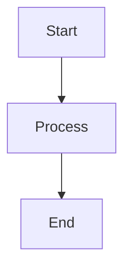

# Plugins

This guide explains how Markmap's plugin system works and how to create custom plugins.

## Table of Contents

- [Plugin System Overview](#plugin-system-overview)
- [Built-in Plugins](#built-in-plugins)
- [Creating Custom Plugins](#creating-custom-plugins)
- [Plugin Examples](#plugin-examples)
- [Advanced Topics](#advanced-topics)

## Plugin System Overview

### What are Plugins?

Plugins extend Markmap's transformation capabilities by:
- Enhancing Markdown parsing (via markdown-it plugins)
- Detecting content features
- Providing additional CSS/JS assets for rendering
- Post-processing HTML output

### Plugin Architecture

```
┌────────────────────────────────────┐
│         Transform Plugin           │
├────────────────────────────────────┤
│  name: string                      │
│  config?: {                        │
│    versions?: {...}                │
│    preloadScripts?: [...]          │
│    resources?: [...]               │
│    styles?: [...]                  │
│    scripts?: [...]                 │
│  }                                 │
│  transform: (hooks) => IAssets     │
└────────────────────────────────────┘
              │
              ▼
      ┌───────────────────┐
      │ Transform Hooks   │
      ├───────────────────┤
      │ parser            │
      │ beforeParse       │
      │ afterParse        │
      │ retransform       │
      └───────────────────┘
```

### Plugin Interface

```typescript
interface ITransformPlugin {
  // Unique plugin identifier
  name: string;
  
  // Optional configuration
  config?: {
    // NPM package versions
    versions?: Record<string, string>;
    
    // Scripts to preload (browser only)
    preloadScripts?: JSItem[];
    
    // Resources for offline mode
    resources?: string[];
    
    // Always-included styles
    styles?: CSSItem[];
    
    // Always-included scripts
    scripts?: JSItem[];
  };
  
  // Transform function
  transform: (hooks: ITransformHooks) => IAssets;
}
```

### Transform Hooks

#### 1. parser Hook

Called once when markdown-it is initialized.

```typescript
hooks.parser.tap((md: MarkdownIt) => {
  // Configure markdown-it
  md.use(someMarkdownItPlugin);
});
```

**Use cases:**
- Add markdown-it plugins
- Configure parser rules
- Set renderer overrides

#### 2. beforeParse Hook

Called before each Markdown parse.

```typescript
hooks.beforeParse.tap((md: MarkdownIt, context: ITransformContext) => {
  // Preprocess content
  context.content = processContent(context.content);
});
```

**Use cases:**
- Extract frontmatter
- Preprocess Markdown
- Initialize context variables

#### 3. afterParse Hook

Called after HTML generation.

```typescript
hooks.afterParse.tap((md: MarkdownIt, context: ITransformContext) => {
  // Analyze HTML for features
  if (context.content.includes('katex')) {
    context.features.katex = true;
  }
});
```

**Use cases:**
- Feature detection
- HTML post-processing
- Metadata collection

#### 4. retransform Hook

Triggers re-transformation.

```typescript
hooks.retransform.tap(() => {
  // Called when retransform is needed
});
```

**Use cases:**
- Refresh when async assets load
- Force re-render in autoloader

---

## Built-in Plugins

### 1. pluginFrontmatter

Extracts YAML frontmatter from Markdown.

**Location:** `packages/markmap-lib/src/plugins/frontmatter/index.ts`

**Syntax:**
```markdown
---
title: My Document
markmap:
  maxWidth: 300
  initialExpandLevel: 2
---

# Content starts here
```

**Implementation:**
```typescript
export default function pluginFrontmatter(): ITransformPlugin {
  return {
    name: 'frontmatter',
    transform: (hooks) => {
      hooks.beforeParse.tap((md, context) => {
        const match = context.content.match(/^---\n([\s\S]*?)\n---\n/);
        if (match) {
          const yaml = match[1];
          context.frontmatter = parseYAML(yaml);
          context.frontmatterInfo = {
            lines: match[0].split('\n').length - 1,
            offset: match[0].length
          };
        }
      });
      return {};
    }
  };
}
```

**Features:**
- Parses YAML frontmatter
- Extracts title and markmap options
- Tracks frontmatter position

---

### 2. pluginKatex

Renders mathematical equations using KaTeX.

**Location:** `packages/markmap-lib/src/plugins/katex/index.ts`

**Syntax:**
```markdown
Inline math: $E=mc^2$

Display math:
$$
\int_0^1 x^2 dx = \frac{1}{3}
$$
```

**Implementation:**
```typescript
export default function pluginKatex(): ITransformPlugin {
  return {
    name: 'katex',
    config: {
      versions: {
        katex: '0.16.9'
      },
      styles: [
        buildCSSItem('katex@{versions.katex}/dist/katex.min.css')
      ],
      scripts: [
        buildJSItem('katex@{versions.katex}/dist/katex.min.js')
      ]
    },
    transform: (hooks) => {
      hooks.parser.tap((md) => {
        md.use(markdownItKatex);
      });
      
      hooks.afterParse.tap((md, context) => {
        const hasKatex = /<span class="katex"/.test(context.content);
        if (hasKatex) {
          context.features.katex = true;
        }
      });
      
      return {};
    }
  };
}
```

**Assets:**
- `katex.min.css` - KaTeX styles
- `katex.min.js` - KaTeX library

---

### 3. pluginHljs

Syntax highlighting using Highlight.js.

**Location:** `packages/markmap-lib/src/plugins/hljs/index.ts`

**Syntax:**
````markdown
```javascript
function hello() {
  console.log('Hello, world!');
}
```
````

**Implementation:**
```typescript
export default function pluginHljs(): ITransformPlugin {
  return {
    name: 'hljs',
    config: {
      versions: {
        'highlight.js': '11.9.0'
      },
      styles: [
        buildCSSItem(
          'highlight.js@{versions.highlight.js}/styles/default.css'
        )
      ],
      scripts: [
        buildJSItem(
          'highlight.js@{versions.highlight.js}/lib/core.js'
        )
      ]
    },
    transform: (hooks) => {
      hooks.parser.tap((md) => {
        md.options.highlight = (str, lang) => {
          if (lang && hljs.getLanguage(lang)) {
            return hljs.highlight(str, { language: lang }).value;
          }
          return '';
        };
      });
      
      hooks.afterParse.tap((md, context) => {
        const hasCode = /<code class="language-/.test(context.content);
        if (hasCode) {
          context.features.hljs = true;
        }
      });
      
      return {};
    }
  };
}
```

**Features:**
- Auto language detection
- Multiple themes support
- Lazy language loading

---

### 4. pluginCheckbox

Renders interactive checkboxes for task lists.

**Location:** `packages/markmap-lib/src/plugins/checkbox/index.ts`

**Syntax:**
```markdown
- [ ] Task 1
- [x] Task 2 (completed)
- [ ] Task 3
```

**Implementation:**
```typescript
export default function pluginCheckbox(): ITransformPlugin {
  return {
    name: 'checkbox',
    transform: (hooks) => {
      hooks.parser.tap((md) => {
        md.inline.ruler.before('text', 'checkbox', (state, silent) => {
          const match = /^\[([ x])\]/.exec(state.src.slice(state.pos));
          if (!match) return false;
          
          if (!silent) {
            const checked = match[1] === 'x';
            const token = state.push('checkbox', 'input', 0);
            token.attrSet('type', 'checkbox');
            if (checked) token.attrSet('checked', 'true');
          }
          
          state.pos += match[0].length;
          return true;
        });
      });
      
      return {};
    }
  };
}
```

---

### 5. pluginNpmUrl

Resolves NPM package URLs to CDN links.

**Location:** `packages/markmap-lib/src/plugins/npm-url/index.ts`

**Features:**
- Converts package@version/path to CDN URLs
- Supports multiple CDN providers
- Version resolution

**Implementation:**
```typescript
export default function pluginNpmUrl(): ITransformPlugin {
  return {
    name: 'npmUrl',
    transform: (hooks) => {
      hooks.parser.tap((md) => {
        const { transformer } = hooks;
        
        md.renderer.rules.link_open = (tokens, idx, options, env, self) => {
          const token = tokens[idx];
          const href = token.attrGet('href');
          
          if (href && /^[^:/]+@[^/]+/.test(href)) {
            // Resolve npm URL
            const fullUrl = transformer.urlBuilder.getFullUrl(href);
            token.attrSet('href', fullUrl);
          }
          
          return self.renderToken(tokens, idx, options);
        };
      });
      
      return {};
    }
  };
}
```

---

### 6. pluginSourceLines

Tracks source line numbers for each node.

**Location:** `packages/markmap-lib/src/plugins/source-lines/index.ts`

**Use case:** Editor integration, debugging

**Implementation:**
```typescript
export default function pluginSourceLines(): ITransformPlugin {
  return {
    name: 'sourceLines',
    transform: (hooks) => {
      hooks.parser.tap((md) => {
        md.core.ruler.push('source_lines', (state) => {
          state.tokens.forEach((token, idx) => {
            if (token.map) {
              token.attrSet('data-line', String(token.map[0]));
            }
          });
        });
      });
      
      return {};
    }
  };
}
```

---

## Creating Custom Plugins

### Step 1: Basic Plugin Structure

```typescript
import { ITransformPlugin, ITransformHooks } from 'markmap-lib';

export default function myPlugin(): ITransformPlugin {
  return {
    name: 'myPlugin',
    transform: (hooks: ITransformHooks) => {
      // Plugin logic here
      
      return {
        styles: [],
        scripts: []
      };
    }
  };
}
```

### Step 2: Add markdown-it Integration

```typescript
export default function myPlugin(): ITransformPlugin {
  return {
    name: 'myPlugin',
    transform: (hooks) => {
      hooks.parser.tap((md) => {
        // Add markdown-it plugin
        md.use(require('markdown-it-plugin-name'));
        
        // Or add custom rule
        md.inline.ruler.push('my_rule', (state, silent) => {
          // Custom parsing logic
          return false;
        });
      });
      
      return {};
    }
  };
}
```

### Step 3: Feature Detection

```typescript
export default function myPlugin(): ITransformPlugin {
  return {
    name: 'myPlugin',
    transform: (hooks) => {
      hooks.afterParse.tap((md, context) => {
        // Check if content uses your feature
        const hasFeature = context.content.includes('my-marker');
        if (hasFeature) {
          context.features.myPlugin = true;
        }
      });
      
      return {};
    }
  };
}
```

### Step 4: Add Assets

```typescript
import { buildJSItem, buildCSSItem } from 'markmap-common';

export default function myPlugin(): ITransformPlugin {
  return {
    name: 'myPlugin',
    config: {
      versions: {
        mylib: '1.0.0'
      },
      styles: [
        buildCSSItem('mylib@{versions.mylib}/dist/style.css')
      ],
      scripts: [
        buildJSItem('mylib@{versions.mylib}/dist/script.js')
      ]
    },
    transform: (hooks) => {
      // ... hook logic
      
      return {};
    }
  };
}
```

### Step 5: Content Preprocessing

```typescript
export default function myPlugin(): ITransformPlugin {
  return {
    name: 'myPlugin',
    transform: (hooks) => {
      hooks.beforeParse.tap((md, context) => {
        // Transform content before parsing
        context.content = context.content.replace(
          /\{myshortcode\}/g,
          'expanded content'
        );
      });
      
      return {};
    }
  };
}
```

---

## Plugin Examples

### Example 1: Emoji Plugin

```typescript
import { ITransformPlugin } from 'markmap-lib';

const emojiMap: Record<string, string> = {
  ':smile:': '😊',
  ':heart:': '❤️',
  ':star:': '⭐'
};

export default function pluginEmoji(): ITransformPlugin {
  return {
    name: 'emoji',
    transform: (hooks) => {
      hooks.beforeParse.tap((md, context) => {
        Object.entries(emojiMap).forEach(([code, emoji]) => {
          context.content = context.content.replace(
            new RegExp(code, 'g'),
            emoji
          );
        });
      });
      
      return {};
    }
  };
}
```

**Usage:**
```markdown
# Welcome :smile:
- Great work :star:
- Love it :heart:
```

### Example 2: Custom Code Block Plugin

```typescript
import { ITransformPlugin } from 'markmap-lib';
import { buildCSSItem } from 'markmap-common';

export default function pluginCustomCode(): ITransformPlugin {
  return {
    name: 'customCode',
    config: {
      styles: [
        buildCSSItem({
          type: 'style',
          data: `
            .custom-code {
              background: #f5f5f5;
              border-left: 4px solid #42b983;
              padding: 1em;
            }
          `
        })
      ]
    },
    transform: (hooks) => {
      hooks.parser.tap((md) => {
        const defaultFence = md.renderer.rules.fence;
        
        md.renderer.rules.fence = (tokens, idx, options, env, self) => {
          const token = tokens[idx];
          const info = token.info.trim();
          
          if (info === 'custom') {
            return `<div class="custom-code">${token.content}</div>`;
          }
          
          return defaultFence(tokens, idx, options, env, self);
        };
      });
      
      hooks.afterParse.tap((md, context) => {
        if (context.content.includes('custom-code')) {
          context.features.customCode = true;
        }
      });
      
      return {};
    }
  };
}
```

**Usage:**
````markdown
```custom
This is custom styled code
```
````

### Example 3: Mermaid Diagram Plugin

```typescript
import { ITransformPlugin } from 'markmap-lib';
import { buildJSItem } from 'markmap-common';

export default function pluginMermaid(): ITransformPlugin {
  return {
    name: 'mermaid',
    config: {
      versions: {
        mermaid: '10.6.1'
      },
      scripts: [
        buildJSItem('mermaid@{versions.mermaid}/dist/mermaid.min.js')
      ]
    },
    transform: (hooks) => {
      hooks.parser.tap((md) => {
        const defaultFence = md.renderer.rules.fence;
        
        md.renderer.rules.fence = (tokens, idx, options, env, self) => {
          const token = tokens[idx];
          const info = token.info.trim();
          
          if (info === 'mermaid') {
            return `<div class="mermaid">${token.content}</div>`;
          }
          
          return defaultFence(tokens, idx, options, env, self);
        };
      });
      
      hooks.afterParse.tap((md, context) => {
        if (context.content.includes('class="mermaid"')) {
          context.features.mermaid = true;
        }
      });
      
      return {
        scripts: [
          {
            type: 'iife',
            data: {
              fn: () => {
                if (window.mermaid) {
                  window.mermaid.initialize({ startOnLoad: true });
                }
              }
            }
          }
        ]
      };
    }
  };
}
```

**Usage:**
````markdown

````

### Example 4: YouTube Embed Plugin

```typescript
import { ITransformPlugin } from 'markmap-lib';

export default function pluginYouTube(): ITransformPlugin {
  return {
    name: 'youtube',
    transform: (hooks) => {
      hooks.beforeParse.tap((md, context) => {
        // Convert YouTube links to embeds
        context.content = context.content.replace(
          /!\[youtube\]\((https:\/\/(?:www\.)?youtube\.com\/watch\?v=([^)]+))\)/g,
          '<iframe width="560" height="315" src="https://www.youtube.com/embed/$2" frameborder="0" allowfullscreen></iframe>'
        );
      });
      
      return {};
    }
  };
}
```

**Usage:**
```markdown

```

---

## Advanced Topics

### 1. Conditional Asset Loading

Load assets only when features are detected:

```typescript
export default function pluginConditional(): ITransformPlugin {
  return {
    name: 'conditional',
    config: {
      // Assets in config are always loaded
      styles: []
    },
    transform: (hooks) => {
      hooks.afterParse.tap((md, context) => {
        context.features.conditional = hasFeature(context.content);
      });
      
      // Return assets that load only when feature detected
      return {
        scripts: [
          buildJSItem('mylib@1.0.0/dist/script.js')
        ]
      };
    }
  };
}
```

### 2. Browser vs Node.js Plugins

```typescript
// index.ts (Node.js)
export default function myPlugin(): ITransformPlugin {
  return {
    name: 'myPlugin',
    config: {
      preloadScripts: [
        // Needed for browser
        buildJSItem('lib@1.0.0/dist/browser.js')
      ]
    },
    transform: (hooks) => {
      hooks.parser.tap((md) => {
        // Use Node.js version
        const lib = require('lib');
        md.use(lib);
      });
      return {};
    }
  };
}

// index.browser.ts (Browser)
export default function myPlugin(): ITransformPlugin {
  return {
    name: 'myPlugin',
    transform: (hooks) => {
      hooks.parser.tap((md) => {
        // Use preloaded browser version
        const lib = window.MyLib;
        md.use(lib);
      });
      return {};
    }
  };
}
```

### 3. Plugin Dependencies

```typescript
export default function pluginDependent(): ITransformPlugin {
  return {
    name: 'dependent',
    transform: (hooks) => {
      hooks.afterParse.tap((md, context) => {
        // Only activate if another plugin is active
        if (context.features.katex) {
          // Do something with KaTeX content
          context.features.dependent = true;
        }
      });
      
      return {};
    }
  };
}
```

### 4. Async Assets Loading

```typescript
export default function pluginAsync(): ITransformPlugin {
  return {
    name: 'async',
    transform: (hooks) => {
      return {
        scripts: [
          {
            type: 'iife',
            data: {
              fn: async () => {
                // Load async
                const module = await import('https://cdn.example.com/module.js');
                module.init();
                
                // Trigger retransform when ready
                hooks.retransform.call();
              }
            }
          }
        ]
      };
    }
  };
}
```

### 5. Custom Context Data

```typescript
export default function pluginContext(): ITransformPlugin {
  return {
    name: 'context',
    transform: (hooks) => {
      hooks.beforeParse.tap((md, context) => {
        // Add custom data to context
        (context as any).myData = {
          timestamp: Date.now(),
          custom: 'value'
        };
      });
      
      hooks.afterParse.tap((md, context) => {
        // Use custom data
        const myData = (context as any).myData;
        console.log('Parsed at:', myData.timestamp);
      });
      
      return {};
    }
  };
}
```

## Using Custom Plugins

### With Transformer

```typescript
import { Transformer } from 'markmap-lib';
import myPlugin from './my-plugin';

const transformer = new Transformer([
  myPlugin,
  // ... other plugins
]);

const result = transformer.transform(markdown);
```

### With CLI

```typescript
// my-cli.ts
import { createMarkmap } from 'markmap-cli';
import { Transformer } from 'markmap-lib';
import myPlugin from './my-plugin';

const transformer = new Transformer([myPlugin]);
const { root, features } = transformer.transform(markdown);
const assets = transformer.getUsedAssets(features);

await createMarkmap({
  content: markdown,
  // ... options
});
```

### With Autoloader

```html
<script>
window.markmap = {
  autoLoader: {
    transformPlugins: [
      // Import your plugin
      MyCustomPlugin
    ]
  }
};
</script>
<script src="markmap-autoloader.js"></script>
```

## Best Practices

1. **Naming**: Use unique, descriptive plugin names
2. **Feature Detection**: Always set `context.features[pluginName]` when feature is used
3. **Asset Efficiency**: Only include necessary assets
4. **Error Handling**: Handle edge cases gracefully
5. **Documentation**: Document plugin syntax and options
6. **Testing**: Test with various content patterns
7. **Performance**: Minimize processing overhead
8. **Compatibility**: Consider browser and Node.js environments

## Next Steps

- See [Getting Started](./07-getting-started.md) for usage guide
- See [Examples](./08-examples.md) for complete examples
- See [APIs](./05-apis.md) for API reference
